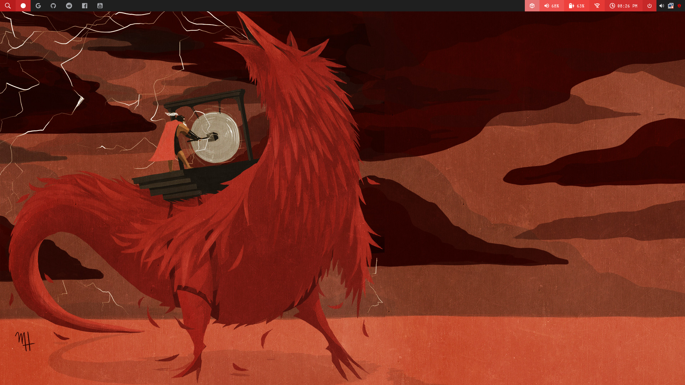
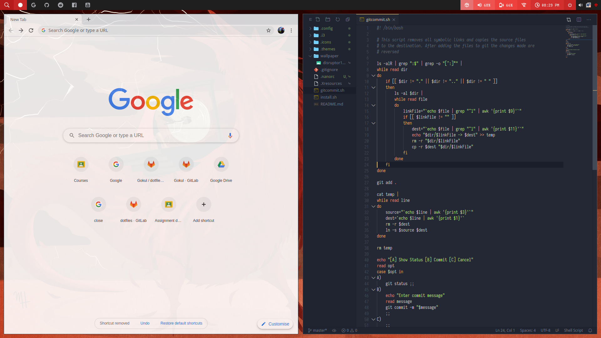
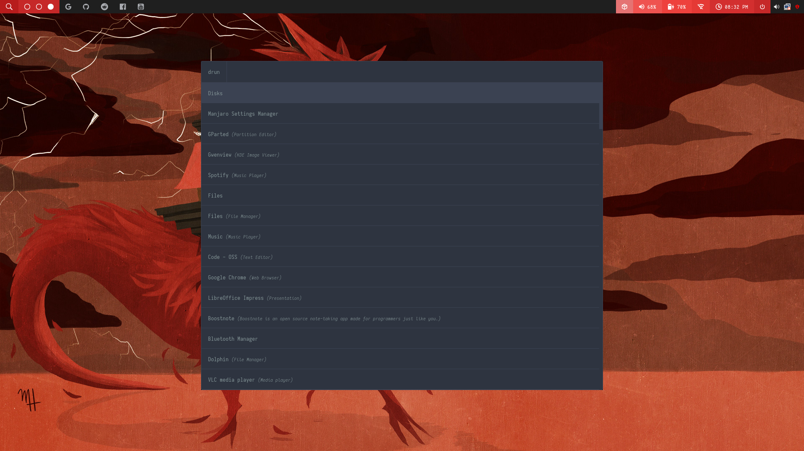
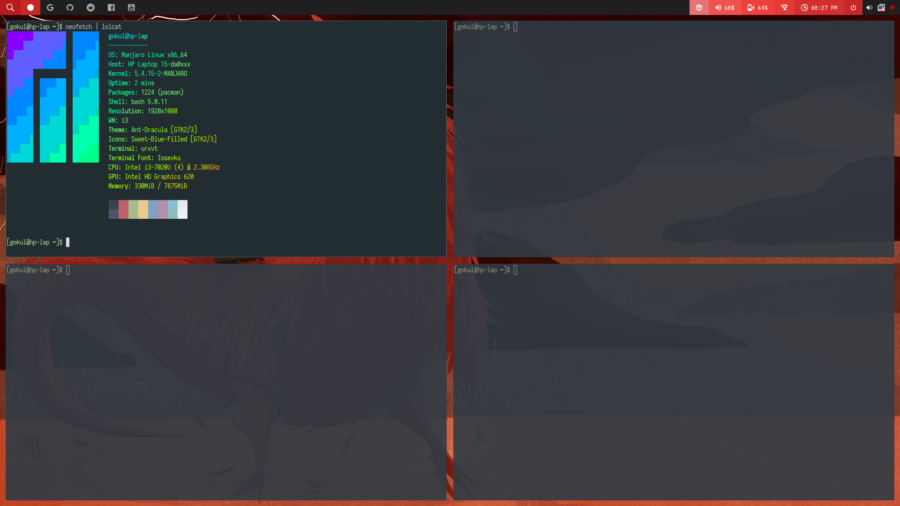

# i3wm config files

## Files

* Gtk theme: [Ant-Dracula](https://github.com/EliverLara/Ant)
* Icon theme: [Sweet Folders](https://github.com/EliverLara/Sweet-folders)
* Wallpaper: [Disruptor](http://mdd.hirshon.net/)
* Polybar theme: [theme-2](https://github.com/adi1090x/polybar-themes)
* Xresource theme: [Nord](https://nordtheme.com)
* Rofi theme: [Nord by u/devdevdevdevdeo](https://github.com/devdevdevdevdeo/dotfiles)

## Requirements
```
    Iosevka font

    polybar
    compton-conf
    lxappearance 
    rofi

    google-chrome
    code
    nautilus




